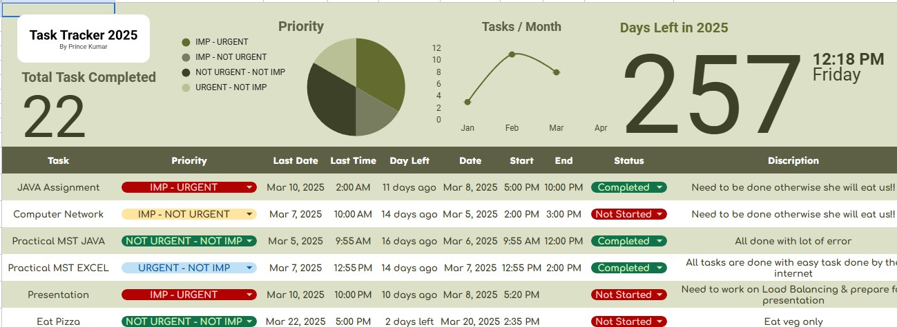

# 📋 Task Tracker (Excel-Based)

  
  

---

## ✨ About the Project

This project is a **Task Tracker** created using **Microsoft Excel**.  
It helps users efficiently manage their daily tasks, view real-time progress, and visualize their work through built-in Excel features like **pie charts**, **progress graphs**, and **smart formulas**.

🎯 Key Features:
- 🕒 Displays the current time and counts remaining days in the year.
- ✅ Instantly track task status ("Completed" or "Pending") with auto-updating charts.
- 🗂️ Categorize tasks as **Urgent**, **Important**, or **Not Important**.
- 📊 Visualize your workload using dynamic **pie charts** and **bar graphs**.
- 📅 Real-time updates using Excel formulas like `IF`, `COUNTIF`, and `TODAY`.

---

## 📚 Why Use This?

Traditional to-do lists—whether on paper or simple digital notes—can quickly become cluttered and hard to manage.  
This Excel-based tracker offers:
- Structured task organization
- Easy task marking
- Automatic real-time updates
- Visually engaging insights for better productivity

It’s ideal for:
- 🎓 Students
- 👩‍💻 Professionals
- 🏡 Personal productivity enthusiasts

And best of all — it **requires no external tools** — just **Excel**!  
Customize it freely to match your personal workflow.

---

## 📦 How to Use

1. Open the `.xlsx` file in Microsoft Excel.
2. Add your tasks under the "Task List" section.
3. Choose the appropriate **Category** and **Status** for each task.
4. Watch your charts and counters update automatically!

---

## 🏆 License

This project is **free to use** for personal and professional purposes.  
If you improve or customize it, feel free to share your version!

---

## 📣 Contributions

Got ideas to make it better? Open an issue or submit a pull request!

---

Made with ❤️ in Excel.
